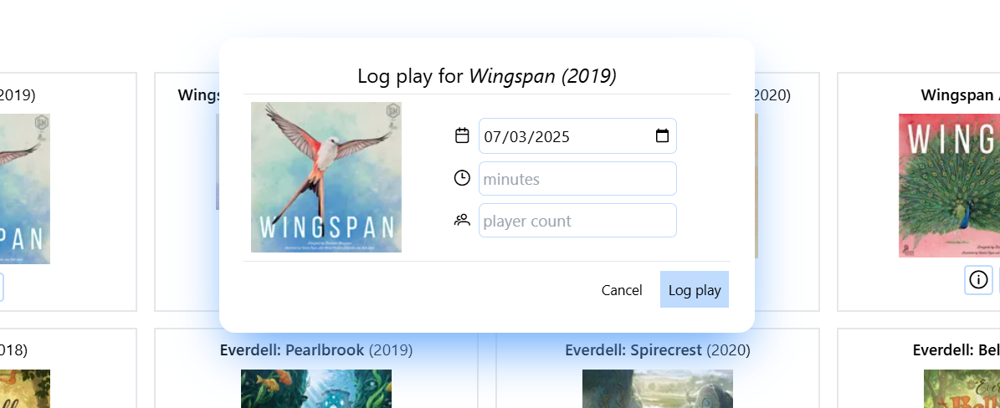

# About Board Game Collection project

Board Game Collection is a hobby project made with Vue3 JS and TailwindCSS and I used it like a playground to practice/learn some stuff about previosly mentioned frontend technologies. With this project I also connected my big board games hobby and practicing/learning frontend technologies.

With this project user can search for board games, add them to collection, log play for board games in collection, delete them from collection, see logged plays.

## Used packages and libraries

[Json Server](https://www.npmjs.com/package/json-server) - NPM library to simulate REST Api <br />
[xml-js](https://www.npmjs.com/package/xml-js) - NPM library to convert XML to JSON <br />
[Vue Toastification](https://vue-toastification.maronato.dev/) - for displaying toast notifications <br />
[Prime icons](https://primeng.org/icons) - for icons <br />
[Vue spinner](https://github.com/greyby/vue-spinner) - for loading spinner

## Used API

[BoardGameGeek XML API 2](https://boardgamegeek.com/wiki/page/BGG_XML_API2#) - to search for board games

## Images





## Customize configuration

See [Vite Configuration Reference](https://vite.dev/config/).

## Project Setup

```sh
npm install
```

### Compile and Hot-Reload for Development

```sh
npm run dev
```

### Run JSON Server library

```sh
npm run server
```

### Compile and Minify for Production

```sh
npm run build
```
